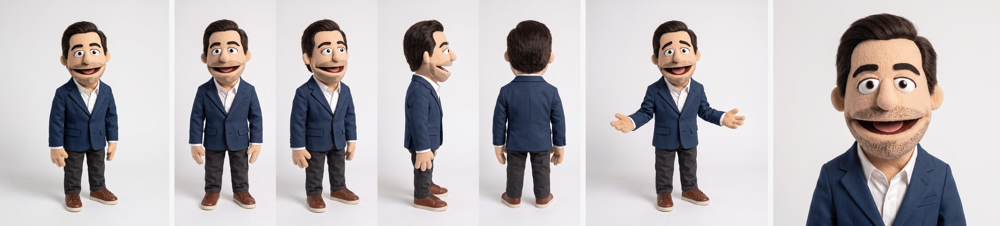
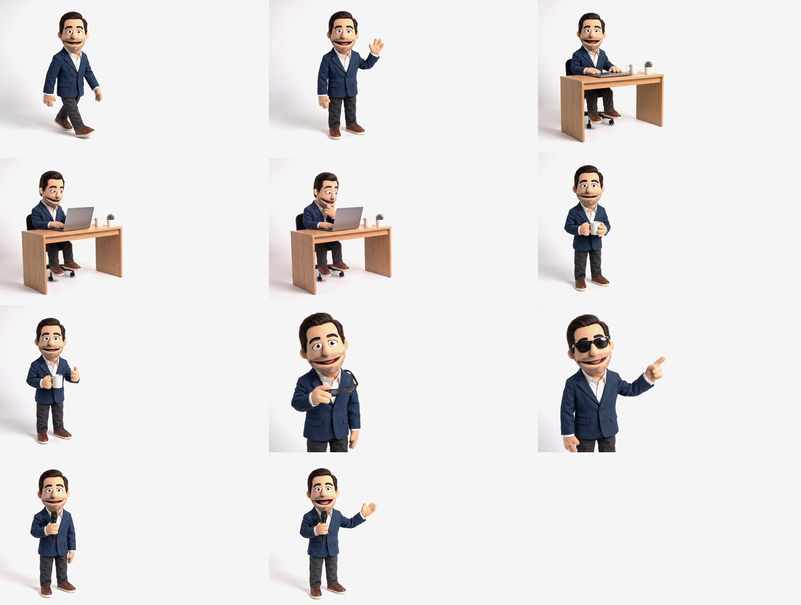

# Ioannis Bekas mascot

A handmade-felt-puppet version of me, generated with [Higgsfield](https://higgsfield.ai). It stars in my portfolio at
[ioannisbekas.github.io](https://ioannisbekas.github.io/), where each section plays one short scene.



## The character

| | |
|---|---|
| Style | Muppet-style felt hand puppet, photographed like a real physical puppet |
| Face | Short dark-brown side-parted faux-fur hair, thick dark felt eyebrows, stubble, big open smile, ping-pong-ball eyes, foam nose |
| Outfit | Navy textured blazer, white open-collar shirt, charcoal chinos, brown leather sneakers |
| Set | Seamless studio background, exactly `#f5f5f5`, soft contact shadow, locked-off camera |

`character/master.png` is the identity reference and `character/turnaround.png` shows front, three-quarter, profile and back views.
Pass both as references whenever you generate something new. `source/headshot.jpg` is the photo the puppet was made from.

## Scenes



Each clip is 5 s, played once when its section scrolls into view, then held on the last frame.
Scene 3 starts on scene 2's last frame (`S2b`), so the two chain.

| Scene | Start → end | Action | Used for |
|---|---|---|---|
| 1 | S1a → S1b | walks in, stops, waves | Hero |
| 2 | S2a → S2b | opens the laptop, starts typing | Work |
| 3 | S2b → S3b | leans in, hand on chin, "aha" | Journey |
| 4 | S4a → S4b | sips coffee, thumbs-up | About |
| 5 | S5a → S5b | puts on sunglasses, points right | Contact |
| 6 | S6a → S6b | speaks into a mic, presents to the right | Talks |

The puppet always stays in the left third so text fits on the right, and the camera never moves.

## Files

```
character/   master, turnaround sheet, avatar (square), shrug (404 page)
keyframes/   final start/end frames, background already flattened to #f5f5f5
video/raw/   Kling 3.0 Pro output, 1928×1076, as generated
video/web/   graded + encoded: sceneN.mp4 (1920×1080) and sceneN_m.mp4 (720×744 mobile crop)
prompts/     every prompt used, per character / keyframe / video
scripts/     flatten.py, align.py, encode.sh, hf_fetch.sh
```

## Making a new scene

Uses the [Higgsfield CLI](https://github.com/higgsfield-ai/cli) (`npm i -g @higgsfield/cli`, then `higgsfield auth login`).

1. **Start frame:** Nano Banana Pro, 16:9, with `master.png` and `turnaround.png` as references, plus an existing
   keyframe to copy the framing from. Reuse the background paragraph from any file in `prompts/keyframes/`.
   ```bash
   higgsfield generate create nano_banana_pro --prompt "$(cat prompts/keyframes/S6a.txt)" \
     --image-references character/master.png --image-references character/turnaround.png \
     --image-references keyframes/S4a.png --aspect_ratio 16:9 --resolution 2k --wait
   ```
2. **End frame:** an *edit* of the start frame ("keep everything identical, change only …"), with the start frame as
   the first reference. If the model reframes, `python scripts/align.py start.png end.png end_aligned.png` snaps it back.
3. **Flatten** both: `python scripts/flatten.py in.png out.png` clamps the background to `#f5f5f5`.
4. **Animate** with Kling 3.0 Pro, sound off:
   ```bash
   higgsfield generate create kling3_0 --prompt "$(cat prompts/video/scene6.txt)" \
     --start-image keyframes/S6a.png --end-image keyframes/S6b.png --mode pro --duration 5 --sound off --wait
   ```
5. **Encode:** `scripts/encode.sh raw.mp4 out/sceneN` grades the clip to `#f5f5f5` and writes desktop, mobile and poster files.

**What worked:** Kling 3.0 respected the start/end frames and locked camera every time. Seedance 2.5 reframed and zoomed
every shot, so it was dropped. Nano Banana Pro edits kept the puppet on-model, but sometimes shifted the framing,
which `align.py` fixes.

## Usage

This is my likeness. Please don't reuse the character or footage without asking.
